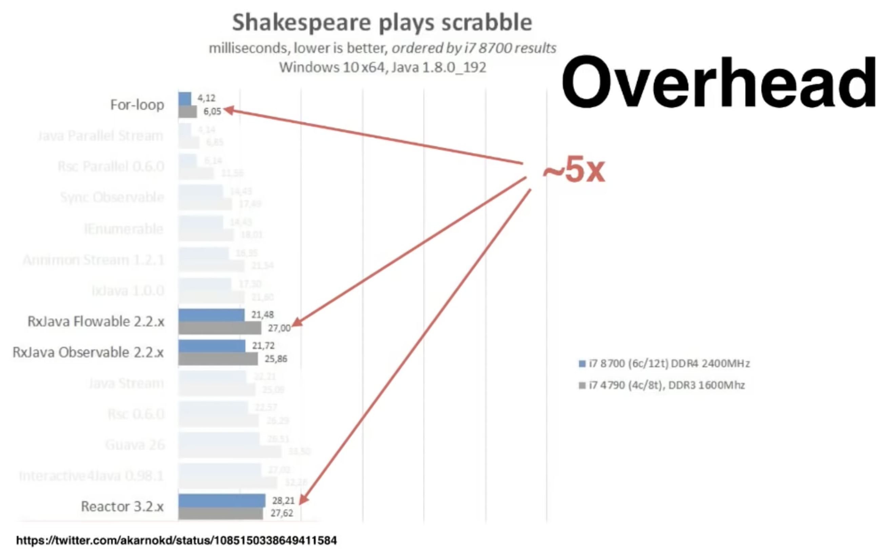
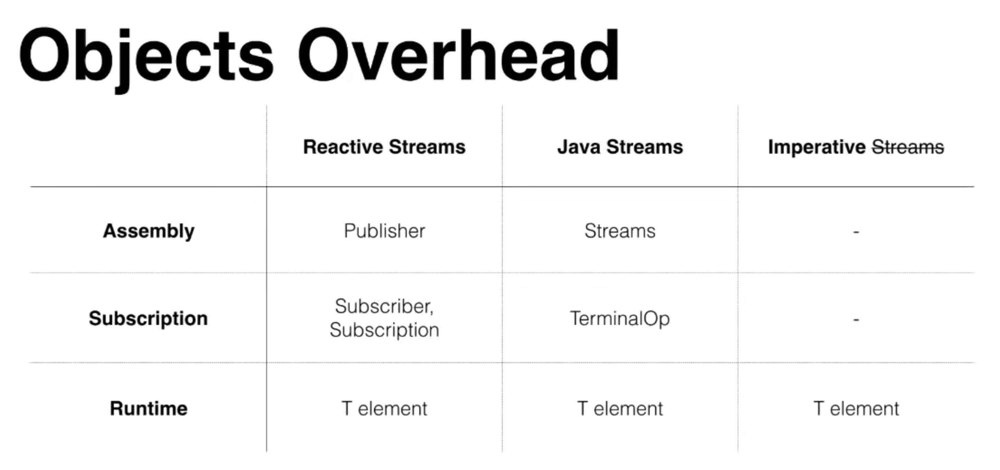
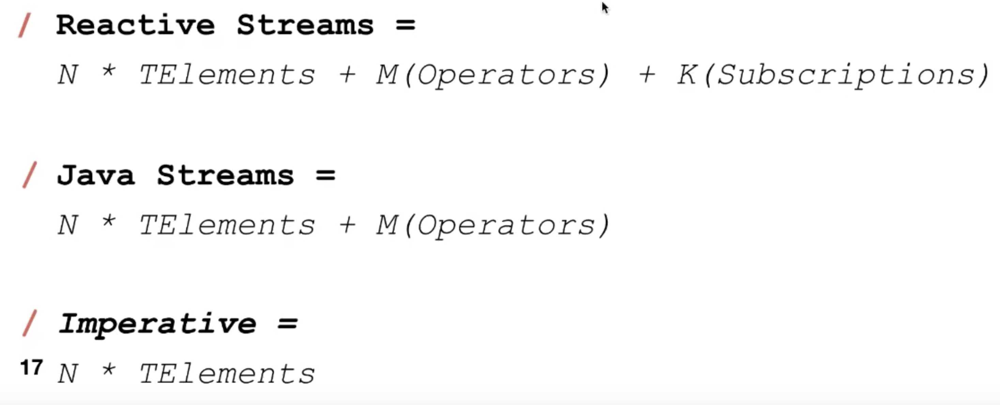
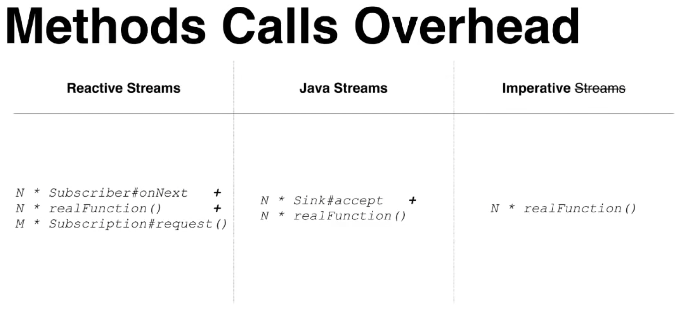
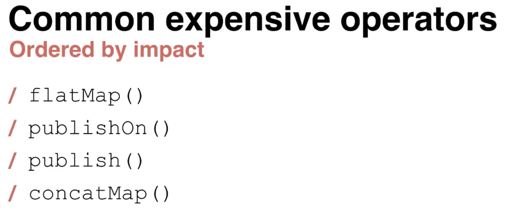

# yet-another-reactor-testing
Yet another...

1. overall reactive streams overhead
   
1. stream objects creation overhead
   
   
1. stream method invocations overhead:
   
1. stream operators overhead:
   
1. tuning:
   * by using Graal JIT
     
   * by using immutable (short lived) objects, so called Young Generation
   * by using operations
   * tune queue:
   ```bash
   -Dreactor.bufferSize.x=1024     # smallest queue (default: 32)
   -Dreactor.bufferSize.small=4096 # small queue (default: 256)
   ```
   NOTE: keep in mind, it will have another impact in memory (using more memory)
   * tube GC `-XX:+UseParallelGC`

## resources

* [Reactive Performance by Oleh Dokuka](https://www.youtube.com/watch?v=pyqIpqCt8PU)

NOTE: _This project has been based on [GitHub: daggerok/main-starter](https://github.com/daggerok/main-starter)_
